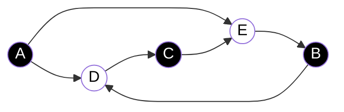

# Homework

1. Create an arithmetic circuit to prove that `x < 17` 
```javascript
// x is in the range 0-31 (2^4 - 1)
x === b0 + 2b1 + 4b2 + 8b3 + 16b4

// ensure bn are binary
b0(b0 - 1) === 0
b1(b1 - 1) === 0
b2(b2 - 1) === 0
b3(b3 - 1) === 0
b4(b4 - 1) === 0

// as 17 and x are 4 bit numbers, I want to check that
// 17 - x > 0 using the midpoint of a 5 bit representation which is 2^(5-1)
2^4 - (16 - x) === a0 + 2a1 + 4a2 + 8a3 + 16a4 + 32a5

a0(a0 - 1) === 0
a1(a1 - 1) === 0
a2(a2 - 1) === 0
a3(a3 - 1) === 0
a4(a4 - 1) === 0

a5 === 1
```

2. Create an arithmetic circuit that takes signals `x₁, x₂, …, xₙ` and is satisfied if at least one signal is 0.
```javascript
x1(x1 - 1) === 0 
x2(x2 - 1) === 0 
//... 
xn(xn - 1) === 0

// ¬x1 v ¬x2 v ... v ¬xn
1 === ((1 - x1) + (1 - x2) - (1 - x1)(1 - x2)) + (1 - x3) - ((1 - x1) + (1 - x2) - (1 - x1)(1 - x2)) (1 - x3) ... // and so on until xn

// I just realized this could be easier
0 === x1x2x3...xn
```

3. Create an arithmetic circuit that takes signals `x₁, x₂, …, xₙ` and is satsified if all signals are 1.
```javascript
// simpler way lol (unsure if this is possible in Circom)
x1 === 1
x2 === 1
// ...
xn === 1

// or a more structured way
x1(x1 - 1) === 0 
x2(x2 - 1) === 0 
//... 
xn(xn - 1) === 0
// x1 and x2 and ... and xn
((x1)(x2)...(xn)) - 1 === 0
```

4. A bipartite graph is a graph that can be colored with two colors such that no two neighboring nodes share the same color. Devise an arithmetic circuit scheme to show you have a valid witness of a 2-coloring of a graph. Hint: the scheme in this tutorial needs to be adjusted before it will work with a 2-coloring.
Proposed VALID bipartite graph (5 nodes):


   
```javascript
// Black = 1
// White = 2

// Enforce nodes are either black or white (1 or 2)
0 === (a - 1)(a - 2)
0 === (b - 1)(b - 2)
0 === (c - 1)(c - 2)
0 === (d - 1)(d - 2)
0 === (e - 1)(e - 2)

// node x node = 2 to exist a valid conection
0 === (ad - 2)
0 === (ae - 2)
0 === (bd - 2)
0 === (ce - 2)
0 === (eb - 2)
0 === (dc - 2)
```

5. Create an arithmetic circuit that constrains `k` to be the maximum of `x`, `y`, or `z`. That is, `k` should be equal to `x` if `x` is the maximum value, and same for `y` and `z`.
```javascript
/*
    I should check 
    GTE(x, y)
    GTE(y, z)
    GTE(x, z),
    and use the MSB of the GTE check 
    as a boolean for a boolean circuit
*/
// Usign just 3 bits for the representation of x, y, z and k

x === x0 + 2x1 + 4x2
y === y0 + 2y1 + 4y2
z === z0 + 2z1 + 4z2

0 === x0(x0 + 1)
0 === x1(x1 + 1)
0 === x2(x2 + 1)

0 === y0(y0 + 1)
0 === y1(y1 + 1)
0 === y2(y2 + 1)

0 === z0(z0 + 1)
0 === z1(z1 + 1)
0 === z2(z2 + 1)

// x >= y?
2^3 + (x - y) === a0 + 2a1 + 4a2 + 8a3 // if a3 is 1, then x >= y
0 === a0(a0 + 1)
0 === a1(a1 + 1)
0 === a2(a2 + 1)
0 === a3(a3 + 1)

// x >= z?
2^3 + (x - z) === b0 + 2b1 + 4b2 + 8b3 // if b3 is 1, then x >= z
0 === b0(b0 + 1)
0 === b1(b1 + 1)
0 === b2(b2 + 1)
0 === b3(b3 + 1)

// y >= z?
2^3 + (y - z) === c0 + 2c1 + 4c2 + 8c3 // if c3 is 1, then y >= z
0 === c0(c0 - 1) 
0 === c1(c1 - 1) 
0 === c2(c2 − 1)
0 === c3(c3 − 1)

// Now, we have a3, b3 and c3
/*
    I want an specific behavior for this 

    a3  b3  c3  greater
    0   0   0     z 
    0   0   1     y
    0   1   0     -
    0   1   1     y
    1   0   0     z
    1   0   1     -
    1   1   0     x
    1   1   1     x

    (when - is in greater, it means that that scenario is not logically possible)
*/

// Next, I will use those bits to construct "selectors"

// (a3 and b3 and c3) or (a3 and b3 and ¬c3)
// the OR operator creates this weird form where: x V y => x + y -xy
// a more efficient selector would be just: a3 * b3, but I wanted it to be as verbose as possible
selector_x === (a3 * b3 * c3) + (a3 * b3 * (1 - c3)) - (a3 * b3 * c3) * (a3 * b3 * (1 - c3))

// from now on I will just simplify the selector's expressions by induction 

// (¬a3 and ¬b3 and c3) or (¬a3 and b3 and c3)
// simplifying...
// ¬a3 * c3
selector_y === (1 - a3) * c3

// (¬a3 and ¬b3 and ¬c3) or (a3 and ¬b3 and ¬c3)
// simplifying...
// ¬b3 and ¬c3
selector_z === (1 - b3) * (1 - c3)

k === selector_x * x + selector_y * y + selector_z * z
```

Note for this previous resolution: It's the first thing that came to my mind after 5 minutes of thinking how to solve it, maybe is not the best way but it's what I could do with the tools I learned in the [ZK Book](https://www.rareskills.io/post/arithmetic-circuit). Please, if you found other way to solve it, open an issue or send a pool request to add yours! 


6. Create an arithmetic circuit that takes signals `x₁, x₂, …, xₙ`, constrains them to be binary, and outputs 1 if at least one of the signals is 1. Hint: this is tricker than it looks. Consider combining what you learned in the first two problems and using the NOT gate.
```javascript
x1(x1 - 1) === 0 
x2(x2 - 1) === 0 
//... 
xn(xn - 1) === 0

// I'm unsure why is this one supposed to be tricky
// it's just x1 or x2 or x3 or ... or xn
1 === ((x1 + x2 - x1x2) + x3 - (x1 + x2 - x1x2)x3) // ... and so on until the last xn
```

7. Create an arithmetic circuit to determine if a signal `v` is a power of two (1, 2, 4, 8, etc). Hint: create an arithmetic circuit that constrains another set of signals to encode the binary representation of `v`, then place additional restrictions on those signals.
```javascript
v === b0 + 2b1 + 4b2 + 8b3

b0(b0 - 1) === 0
b1(b1 - 1) === 0
b2(b2 - 1) === 0
b3(b3 - 1) === 0

1 === b0 + b1 + b2 + b3
```

8. Create an arithmetic circuit that models the Subset sum problem. Given a set of integers (assume they are all non-negative), determine if there is a subset that sums to a given value `k`. For example, given the set `{3, 5, 17, 21}` and `k = 22` there is a subset `{5, 17}` that sums to `22`. Of course, a subset sum problem does not necessarily have a solution.

For this one I'm not sure about what the exercise is asking. I guess that S and k are public inputs and the prover inputs just which values from S compute k. Esentially, the prover provides the subset. But I don't know, it sounds super easy that way.
```javascript
b0(b0 - 1) === 0
b1(b1 - 1) === 0
b2(b2 - 1) === 0
b3(b3 - 1) === 0

3b1 + 5b2 + 17b3 + 21b4 === 22
```
After re-reading it and doing exercise 9, I guessed that k and S are prover inputs too so it would be like this (easy anyways):
```javascript
b0(b0 - 1) === 0
b1(b1 - 1) === 0
b2(b2 - 1) === 0
b3(b3 - 1) === 0

// This should read like, given the set {s0, s1, s2, s3} there is a subset generated by signals b0, b1, b2, b3 whose elements added are equal to k
s0 * b0 + s1 * b1 + s2 * b2 + s3 * b3 === k
```

9. The covering set problem starts with a set `S={1, 2, ..., 10}` and several well-defined subsets of `S`, for example `{1, 2, 3}, {3, 5, 7, 9}, {8, 10}, {5, 6, 7, 8}, {2, 4, 6, 8}`, and asks if we can take at most `k` subsets of `S` such that their union is `S`. n the example problem above, the answer for `k = 4`, is true because we can use `{1, 2, 3}, {3, 5, 7, 9}, {8, 10}, {2, 4, 6, 8}`. Note that for each problems, the subsets we can work with are determined at the beginning. We cannot construct the subsets ourselves. If we had been given the subsets `{1, 2, 3}, {4, 5}, {7, 8, 9, 10}` then there would be no solution because the number `6` is not in the subsets.

On the other hand, if we had been given `S = {1, 2, 3, 4, 5}` and the subsets `{1}, {1, 2}, {3, 4}, {1, 4, 5}` and asked can it be covered with `k = 2` subsets, then there would be no solution. However, if `k = 3` then a valid solution would be `{1, 2}, {3, 4}, {1, 4, 5}`.

Our goal is to prove for a given set `S` and a defined list of subsets of `S`, if we can pick a set of subsets such that their union is `S`. Specifically, the question is if we can do it with `k` or fewer subsets. We wish to prove we know which `k` (or fewer) subsets to use by encoding the problem as an arithmetic circuit.


This one is similar than the n° 8 but the exercise is more clear: the prover has to input the amount of subsets "k" and which subsets are going to be used.
```javascript
/*
    What needs to be done:
        -   each subset will have a signal to say that it has to be added in the union
        -   k is equal to te amount of subsets used

    Naming explanation: 
        -   bn -> signal of the n subset
        -   ssnm -> the m element of the n subset

    S = {1, 2, 3, 4, 5, 6, 7, 8, 9, 10}
    s0={1, 2, 3}
    s1={3, 5, 7, 9}
    s2={8, 10}
    s3={5, 6, 7, 8}
    s4={2, 4, 6, 8}
*/
// Enforce signals that says the subset is used are indeed signals (0-1)
b0(b0 - 1) === 0
b1(b1 - 1) === 0
b2(b2 - 1) === 0
b3(b3 - 1) === 0
b4(b4 - 1) === 0

// k is equal to the amount of subsets used in the union
k === b0 + b1 + b2 + b3 + b4

// Now I have to check the union given those turned on signals bn 
// This below means that the element is present in at least one of the subsets selected
sel_1 === b0
sel_2 === b0 + b4 - b0b4
sel_3 === b0 + b1 - b0b1
sel_4 === b4
sel_5 === b1 + b3 - b1b3
sel_6 === b3 + b4 - b3b4
sel_7 === b1 + b3 - b1b3
sel_8 === b3 + b4 - b3b4
sel_9 === b1
sel_10 === b2

// If all are present in the selected subsets, the following constraint is true
1 === sel_1 * sel_2 * sel_3 * sel_4 * sel_5 * sel_6 * sel_7 * sel_8 * sel_9 * sel_10
```

Note: I'm unsure about my interpretation of the exercises, I guess it is because I tend to think as if I were programming the thing and not writing an arithmetic circuit.